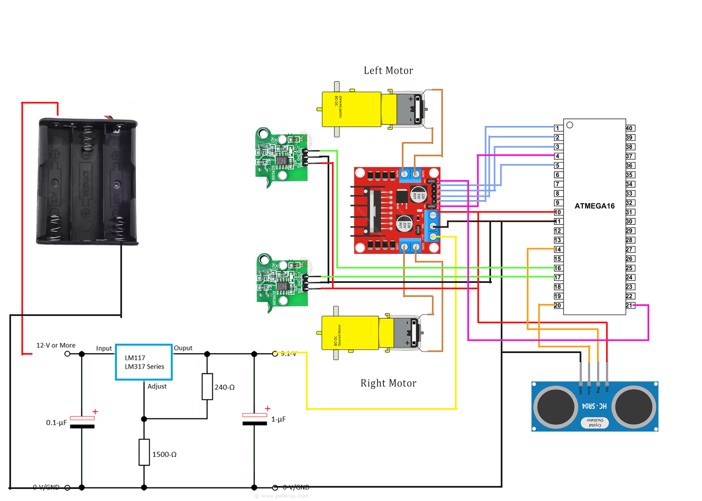

# AVR Path Finder

## Table of Contents

- [Introduction](#introduction)
- [Methodology](#methodology)
- [Fine Tuning](#fine-tuning)
  - [Block Dimension](#block-dimension)
  - [Block movement](#block-movement)
  - [PWM Values](#pwm-values)
  - [Turning](#turning)
- [Know your direction](#know-your-direction)
- [Source and Destination](#source-and-destination)
- [Using a small grid](#using-a-small-grid)
- [AVR Details](#avr-details)
  - [External Interrupts](#external-interrupts)
  - [PWM Signals](#pwm-signals)
  - [Ultrasonic Sensor HC SR-04](#ultrasonic-sensor-hc-sr-04)

## Introduction

This project aims at making an autonomous navigation robot which moves from source to destination in a 6x6 grid while avoiding the obstacles in its way. It is equipped with:

- 1 HC SR-04 sensor for obstacle detection
- 2 Optical encoders for odometry
- 2 DC motors for motion
- 1 AVR ATmega16a microcontroller for processing

## Methodology

The project is divided into 3 parts:

- **Path Planning** - The robot is given a source and destination and it finds the shortest path between them using the A\* algorithm.
- **Path Following** - The robot follows the path generated by the A\* algorithm using the optical encoders for odometry.
- **Obstacle Avoidance** - The robot uses the HC SR-04 sensor to detect obstacles in its path and avoid them.

The pipeline forms a closed loop system. The robot starts from the source and follows the path generated by the A\* algorithm. If an obstacle is detected, the robot stops and generates a new path to the destination. This process is repeated until the robot reaches the destination.

Following are the schematics of the robot:



## Fine Tuning

Movement of the robot is affected by the following parameters:

- **Wheel Radius** - The radius of the wheels of the robot.
- **Surface Friction** - The friction between the wheels and the surface.
- **Operating Voltage** - The voltage supplied to the motors.
- **Motor Type** - The type of motor used.

### Block Dimension

The robot measures distance using the optical encoders and moves across one block at a time. The dimension of block in $cm$ can be set in <code>movements.h</code> file using the <code>BLOCK_SIZE</code> marco.

### Block movement

We measure the number of ticks required to move $1\ cm$. This can be done my setting the number of ticks to an arbitrary value and measuring the distance moved by the robot. The number of ticks required to move $1\ cm$ can be calculated using the following formula:
$$ticksPerCm = \frac{arbitrary\ ticks}{distance\ moved}$$

Set the value of <code>ticksPerCm</code> in <code>movements.h</code> file.

### PWM Values

If the robot is not moving in a straight line, the PWM signals need to be fine tuned. This is an hit and trial process. The PWM signals can be fine tuned by changing the values of <code>OCR0</code> and <code>OCR2</code>.<br>
The values in percentage can also be set in the <code>rightDutyCycle</code> and <code>leftDutyCycle</code> variables in file. These values are set in Timer OCRs only once in the setup. If you want to change the signal on the go, you can use the following functions:

```c
void setRightDuty(double perc);
void setLeftDuty(double perc);
```

Both timers are used without pre-scalars so max value is 255. PWM signals are set in percentage using the following formula:
$$PWM=\frac{value*255}{100}$$

### Turning

Once the robot is moving block by block in a straight line, turnings should be tuned. This can be done by setting the <code>turns</code> variable in <code>movements.h</code> file. The value of <code>turns</code> is the number of ticks required to turn the robot by $90^{\circ}$.

## Know your direction

The full grid looks like this:

|     |     |     |     |     |     |
| --- | --- | --- | --- | --- | --- |
| 35  | 34  | 33  | 32  | 31  | 30  |
| 29  | 28  | 27  | 26  | 25  | 24  |
| 23  | 22  | 21  | 20  | 19  | 18  |
| 17  | 16  | 15  | 14  | 13  | 12  |
| 11  | 10  | 9   | 8   | 7   | 6   |
| 5   | 4   | 3   | 2   | 1   | 0   |

To keep track of the facing direction of the robot, we set the state in <code>curBotDir</code> in <code>main.c</code>. It uses the following convention:

| Value | Direction | Grid   |
| ----- | --------- | ------ |
| 1     | Up        | 0 -> 6 |
| 2     | Down      | 6 -> 0 |
| 3     | Left      | 0 -> 1 |
| 4     | Right     | 1 -> 0 |

**By default the robot is at 0th position facing 6th block.**

## Source and Destination

The starting point of robot in the grid can be set by in the <code>curBotPos</code> variable in <code>main.c</code>. The destination can be set in the <code>destination</code> variable in <code>main.c</code>.

## Using a small grid

If you wish to use a smaller grid, you can add imaginary obstacles in the boundary of the grid. This will force the robot to take the shortest path while avoiding the boundary. This can be done in <code>setGoal</code> function in <code>main.c</code>
For Example:

```c
...
else if (PF.Map[i][k].gridNom == 4 || PF.Map[i][k].gridNom == 10) {
                PF.Map[i][k].index = 2; // initial wall
}
...
```

This will add a wall at blocks 4 and 10 in the grid.

## AVR Details

### External Interrupts

<code>INT0</code> and <code>INT1</code> external interrupts are used for the left and right encoders respectively. Both interrupts are synchronous in operation. The interrupts are triggered on the rising edge of the signal. Following is the setup for the interrupts:

```c
// setup for speed encoders
GICR |= (1 << INT1) | (1 << INT0);							   // enable INT0 and INT1
MCUCR |= (1 << ISC11) | (ISC10) | (1 << ISC01) | (1 << ISC00); // detect changes on rising edge for INT1 and INT0
```

### PWM Signals

Timer 0 and Timer 2 are used for generating PWM signals for the motors. Both timers are used without pre-scalars so max value is 255. Following is the setup for the timers:

```c
DDRB |= (1 << rightPWM);
DDRD |= (1 << leftPWM);

TCCR0 = (1 << COM01) | (1 << WGM00) | (1 << WGM01); // set non-inverting Fast PWM mode on timer0
TCCR2 = (1 << COM21) | (1 << WGM20) | (1 << WGM21); // set non-inverting Fast PWM mode on timer2
TIMSK = (1 << TOIE0) | (1 << TOIE2);
OCR0 = (rightDutyCycle / 100) * 255;
OCR2 = (leftDutyCycle / 100) * 255;

...

// start timers just before while(1) loop
TCCR0 |= (1 << CS00);
TCCR2 |= (1 << CS20);

```

### Ultrasonic Sensor HC SR-04

Timer Input Capture is used to measure the pulse width sent by the sensor on echo pin. First the timer is set to detect the rising edge of the echo pulse. In the ISR of timer, if the detection is rising edge, the timer is reset and set to detect falling edge. If the detection is falling edge, the timer value is stored in a variable. The timer is then reset and set to detect rising edge again. The timer value is then converted to distance using the following formula:

$$ d = \frac{vt}{2f}$$

$$d = \frac{t}{58} \ cm$$

Following the setup for the timer:

```c
// setup for Sonar
TCCR1A = 0;
TCCR1B |= (1 << ICES1); // detect rising edge
TIMSK |= (1 << TICIE1);
```

The Interrupt Service Routine for the timer is as follows:

```c
volatile unsigned char rising = 1;
volatile unsigned char obstacle = 0;

...

ISR(TIMER1_CAPT_vect)
{
	if (rising)
	{
		TCCR1B &= ~(1 << ICES1); // detect falling edge next time
		TCCR1B |= (1 << CS10);	 // start timer
		rising = 0;
	}
	else
	{
		fallingTime = ICR1;
		TCCR1B |= (1 << ICES1); // detect rising edge next time
		rising = 1;
		TCCR1B &= ~(1 << CS10); // stop the timer
		TCNT1 = 0;
		distance = (fallingTime) / 58;
		triggerSonar();
		if (distance < threshold)
		{
			obstacle = 1;
		}
		else
		{
			obstacle = 0;
		}
	}
}
```

## Acknowledgement

I extend my gratitude to [Frank](mailto:xianzhejin@163.com) for providing the base code for A\* algorithm.
